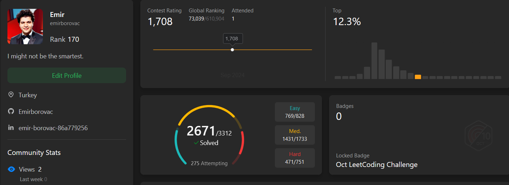
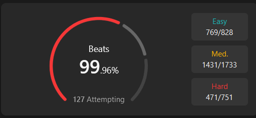
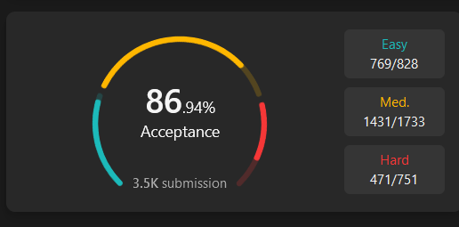

# 🚀 LeetCode Cracker: API-Powered Problem Solving with GPT-4o 🧠

## 📄 Overview

This project is designed to showcase my skills with **API integrations**, specifically using the **OpenAI GPT-4o API** and **prompt engineering**. It demonstrates how precise and powerful GPT coding can be when the prompt is well-designed. From scraping problem links to solving and submitting solutions, this project automates the entire LeetCode problem-solving process.

Initially, my rank on LeetCode was above **2 million**. After implementing this approach, my rank skyrocketed to **170** within just 15 days!

<p align="center">
    
    
</p>

Moreover, I outperformed **99.9%** of users across **hard**, **medium**, and **easy** problems! 🚀

<p align="center">
    
</p>

---

## 🛠 Prerequisites

To run this project, you'll need the following:

- Python 3.7+
- Google Chrome (latest version)
- Selenium
- WebDriverManager
- OpenAI Python API
- PyAutoGUI
- Pandas

---

## ⚙️ How It Works

### Step 1: Scraping the Problems

The first step involves scraping LeetCode problem links using the `scrape.py` script. You can focus on specific types of problems (e.g., **Easy**, **Medium**, or **Hard**) by manually adjusting filters on the [LeetCode Problems Page](https://leetcode.com/problemset/all/) and copying the custom URL.

Modify the following section in `scrape.py` to use your preferred filters:

```python
# In scrape.py
driver.get("https://leetcode.com/problemset/?status=NOT_STARTED&page=1")  # Change this URL based on your custom filters.
```

Run the scraping script using:

```bash
python scrape.py
```

The script will scrape all listed problems on the LeetCode page and save them to `problems-database.xlsx`.

---

### Step 2: Solving the Problems

Once you've scraped the problem links, the `solver.py` script will solve them using **GPT-4o**. It generates solutions based on the problem description and starter code.

You can change the generated solution's language by logging into your LeetCode account, navigating to any problem, and selecting the desired language in the code editor. The script will respect your language preference during the solution generation.

Run the solving script with:

```bash
python solver.py
```

The solutions will be saved in `problems.xlsx` along with the programming language and the submission status.

---

### Step 3: Analytics and Results

After running the process, my analytics showed an **87% acceptance rate**, which is impressive given the complexity of the problems solved.

<p align="center">
    
</p>

---

## 🔑 Key Features

- **Customizable Scraping**: Easily adjust filters on LeetCode and update the scrape URL to focus on specific types of problems.
- **Flexible Language Support**: Choose the programming language for your solutions by selecting your language preference on LeetCode before running the solver.
- **No Reliance on Existing Solutions**: This method doesn’t scrape existing solutions. Instead, it uses GPT-4 to generate original solutions based on problem descriptions and starter code.
- **Collaborate & Enhance**: Open to collaboration! Anyone who wants to enhance this code is welcome to contribute.

---

## 🎯 Conclusion

This project demonstrates the power of combining **Selenium**, **OpenAI's GPT-4o API**, and proper **prompt engineering** to automate coding problems at a high level. The results are evident in the improved rank and problem-solving capability.

---

## 🤝 Contributing

Contributions are encouraged! Feel free to fork the repository and submit pull requests to improve the code or add new features.

For any questions or collaborations, please don’t hesitate to contact me!

---

✨ *Happy Coding!*
